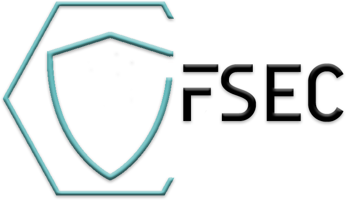

Vulnerability Management System, being developed in the Republic of Belarus  

  

  

## Table of contents
* [About](#general-info)
* [Possible](#possible)
* [Warning](#warning)
* [Run tests](#run-tests)
* [Quick Start in Ubuntu(Debian)](#quick-start-in-ubuntudebian)
* [License](#license)

## Give a Star! :star:
If you like the project, please consider giving it a star to raise awareness!

## General info
**"FSEC VM"** is a new generation **vulnerability Management System**. The solution allows you to build a full-fledged vulnerability management process, search for information
about the organization in open sources, assess the state of security in real time, make a forecast of the security of the organization
for the future, as well as to analyze compliance with the requirements of the regulatory legal acts of the regulator in the Republic of Belarus.
**This is not a Vulnerability scanner!**
## Possible
- Continuous control of the organization's infrastructure through automatic network inventory;
- Identification and daily automatic scanning of important assets in the network, aimed at timely response when vulnerabilities are found;
- Identification and prioritization of discovered vulnerabilities and exploits. This is achieved through the use of the analytics module, which is part of the software product;
- Daily report on the state of infrastructure security;
- Immediate notification (telegram, email) to the system administrator: about the discovery or change of assets in the network, the discovery of new vulnerabilities and the emergence of new exploits for previously discovered vulnerabilities;
- Control of elimination of vulnerabilities;
- Creating custom plugins for searching for vulnerabilities.
- **Monitoring compliance** with the requirements of regulatory legal acts of the regulator **in the Republic of Belarus**.
- Search for information about the company in open sources (**OSINT**);
- Analysis of all received data in **real time** to obtain a comprehensive assessment of the security status of the information system. 

## Warning
The development is of interest to the community, but please wait for the preliminary beta and do not use it in a production environment.

The system is under active development by one person and there are many ideas ahead, but consider supporting it and giving it a star to raise awareness! 

**UDP:** **Pre-release of the first beta version at the end of February 2022** 

## Run tests

Tests for this project are defined in the ``tests/`` folder.

This project uses [pytest](https://docs.pytest.org/) to define tests because it allows you to use the ``assert`` keyword with good formatting for failed assertations.

To run all the tests of a project, simply run the ``pytest`` command: ::

    $ pytest --cov=app tests/

## Quick Start in Ubuntu(Debian)
1. Install Docker: 
``sudo apt install docker.io``
2. Install Redis:
``sudo docker run --restart=always -d --name redis_1 -v /opt/redis/etc/redis.conf:/usr/local/etc/redis/redis.conf -v /opt/redis/data:/data -p 0.0.0.0:6379:6379 redis redis-server /usr/local/etc/redis/redis.conf``
3. Install Mongo:
``sudo docker run --restart=always -d --name mongodb_1 -v mongodata:/data/db -p 0.0.0.0:27017:27017 mongo``
4. Build FSEC_VM image: 
``
sudo docker build -t fsec ./
``
5. Run a container based on your image:
``sudo docker run -d --name fsec_vm -p 0.0.0.0:8000:8000 fsec
``

## Maintainers

This repository is currently maintained by [@Crocup](https://github.com/crocup). 

## License

This project has been released under the GPL-3.0 license. More information can be found by viewing the license [here](LICENSE).